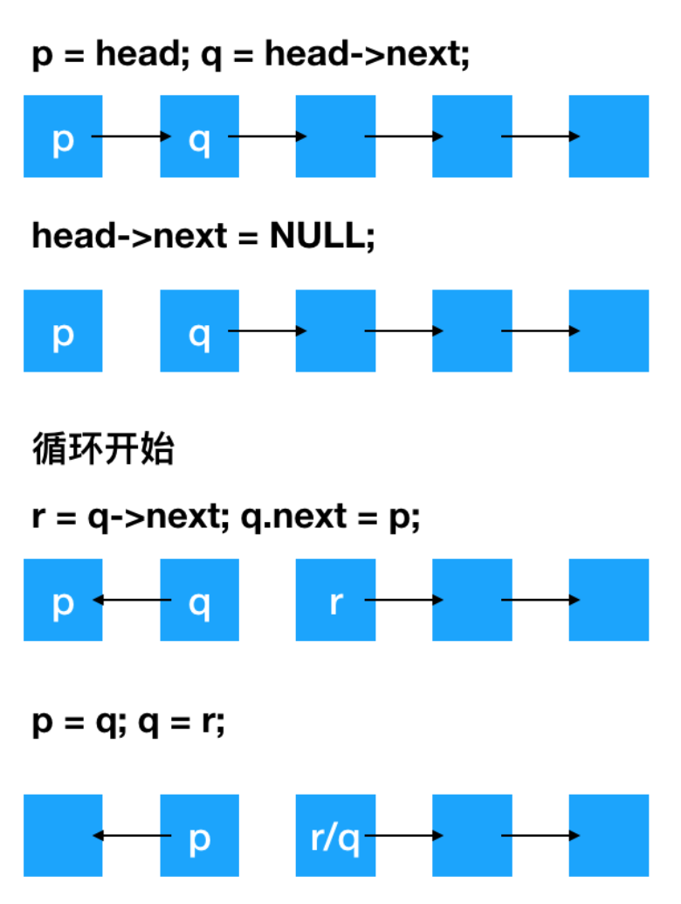

# 单链表翻转

[code](./single_linked_list_reverse.go)

## 方法一

> 将单链表储存为数组，然后按照数组的索引逆序进行反转。

## 方法二

> 使用3个指针遍历单链表，逐个链接点进行反转。

使用p和q两个指针配合工作，使得两个节点间的指向反向，同时用r记录剩下的链表。

## 方法三

> 对于一条链表，从第二个节点到第N个节点，依次逐节点插入到第一个节点之后，n-1次之后，将第一个节点放到表尾即可。

## 方法四
> 递归法, 见注释
